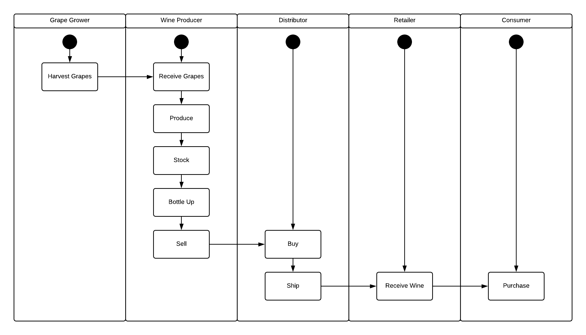
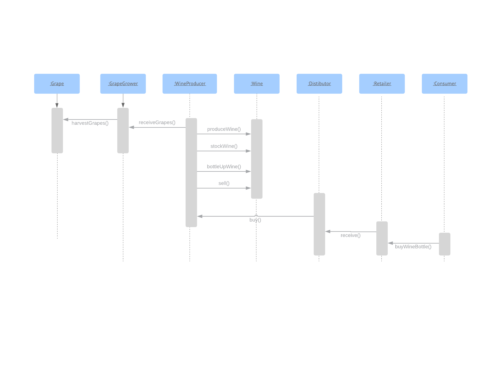
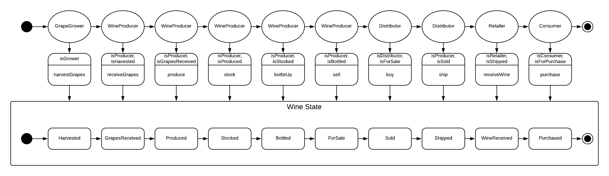
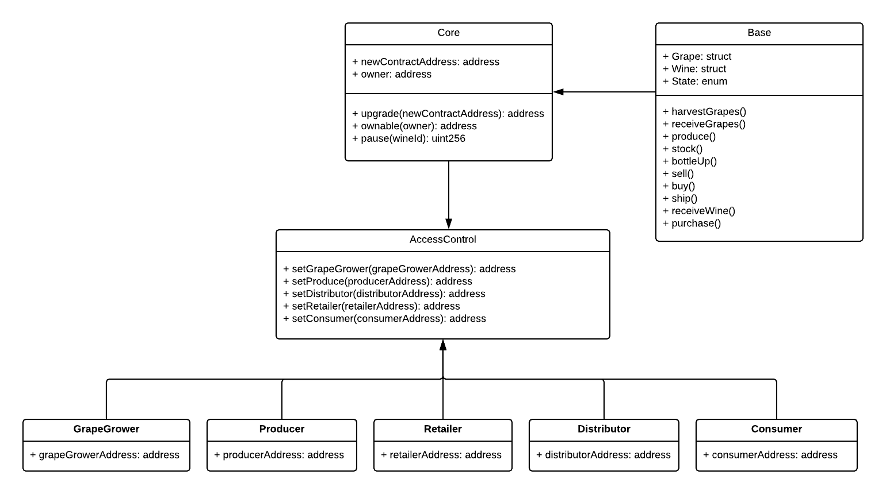

# Supply chain

This repository containts an Ethereum DApp that demonstrates a Supply Chain flow between a Seller and Buyer. The user story is similar to any commonly used supply chain process. A Seller can add items to the inventory system stored in the blockchain. A Buyer can purchase such items from the inventory system. Additionally a Seller can mark an item as Shipped, and similarly a Buyer can mark an item as Received.

## Architecture

### Activity Diagram


### Sequence Diagram


### State Diagram


### Class Diagram


## Getting Started

These instructions will get you a copy of the project up and running on your local machine for development and testing purposes. See deployment for notes on how to deploy the project on a live system.

### Prerequisites

Please make sure you've already installed ganache-cli, Truffle and enabled MetaMask extension in your browser.

### Installing

A step by step series of examples that tell you have to get a development env running

Clone this repository:

```
git clone https://github.com/carlosfjunior/supplychain.git
```

Change directory to ```supplychain``` folder and install all requisite npm packages (as listed in ```package.json```):

```
cd supplychain
npm install
```

Launch Ganache:

```
ganache-cli -m "gap connect jealous champion video protect half concert warrior wing raven armed"
```

In a separate terminal window, Compile smart contracts:

```
truffle compile
```

This will create the smart contract artifacts in folder ```build\contracts```.

Migrate smart contracts to the locally running blockchain, ganache-cli:

```
truffle migrate
```

Test smart contracts:

```
truffle test
```

## Contract Address

```
GrapeGrowerRole: 0x3aa3ccaa2985dc25c7c63a9959506c91299e36b4
ProducerRole: 0x6a8618361a1fa1e4926fe89196632e508a467855
DistributorRole: 0x1a156ace14f4fab358382071a4db544acc4d1c29
RetailerRole: 0xac5d343e73a14c6b97047bbbc52acaf9bf3ae4a2
ConsumerRole: 0x4811218fe5922d15d3e6994c529d24797d9cd898
SupplyChain: 0x689bf79a21b43abbf989b6df32de5cb120467d72
```
## Built With

* [Ethereum](https://www.ethereum.org/) - Ethereum is a decentralized platform that runs smart contracts
* [Truffle Framework](http://truffleframework.com/) - Truffle is the most popular development framework for Ethereum with a mission to make your life a whole lot easier.
